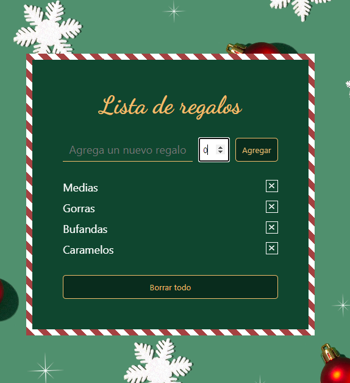
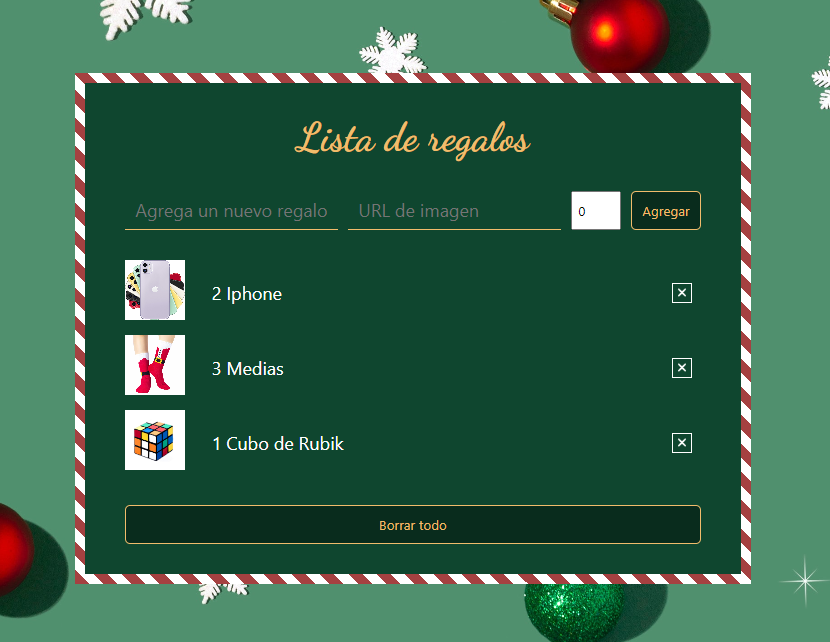
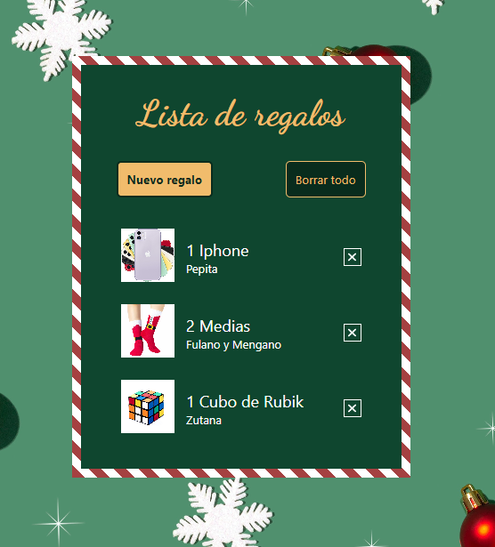

# Adviency - 2022

Calendario de adviento creado por [Goncy](https://twitter.com/goncy/status/1597581725382721538) para practicar. En este caso, voy a usar React con Typescript.

## Dia 1

Para calentar motores vamos a mantener las cosas simples, mostremos una lista de regalos, 3 elementos, fijos, sin nada más. 

## Dia 2

Día 2: Nuestra app se ve muy poco navideña, demosle unos colores más lindos, rojo, verde, amarillo! Podemos ponernos creativos con lo que queramos!

## Dia 3

Día 3: Estámos generosos, vamos a agregar un formulario con un input para escribir nuestro regalo y un botón para agregarlo a nuestra lista, todavía no los podemos borrar, pero... es navidad! Por que querríamos borrar regalos?

## Dia 4

Día 4: Papa noel no estuvo muy contento con la demanda de regalos, vamos a tener que agregar un botón de eliminar a cada elemento para poder borrarlos individualmente.

 

## Dia 5

Día 5: La gente está muy indecisa y agrega muchos regalos y después los debe borrar de a uno! Agreguemos un botón para eliminar todos los regalos a la vez!

 

## Dia 6

Día 6: Nuestra aplicación no se ve muy bien cuando no hay regalos, agreguemos un mensaje alentando a agregar regalos cuando no haya ninguno!

 

## Dia 7

Tuvimos algunos reportes de regalos vacíos o repetidos, asegurmosnos que la gente solo pueda agregar un regalo si escribió algo y si ese regalo no está ya en la lista!

 

## Dia 8

Cometimos un error el día anterior, la gente quiere agregar regalos repetidos para regalarselos a diferentes personas, agreguemos un campo al lado del input de texto para poner la cantidad de unidades del regalo que deberíamos comprar.

 

## Dia 9

Día 9: La gente está triste por que al cerrar la aplicación pierde todos sus regalos 😢. Usemos localStorage para guardar los regalos en el dispositivo del usuario y cargarlos cuando vuelve!

## Dia 10

Día 10: Las palabras dicen mucho pero las imágenes más! Agreguemos un campo donde podamos pegar un link de imágen para cada regalo y mostremoslo en la lista.

 

## Dia 11

Día 11: Nuestro formulario tiene muchas cosas y molesta a la vista de los usuarios, pasemoslo a un modal / drawer o lo que quieras y pongamos un botón de "Agregar regalo" que lo muestre.

 

## Dia 12

Día 12: La gente no recuerda que regalo corresponde a cada quien, agreguemos un campo para destinatario y mostremoslo.

 
