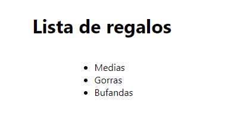
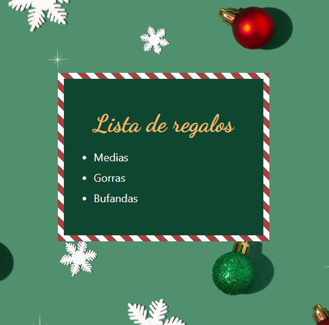
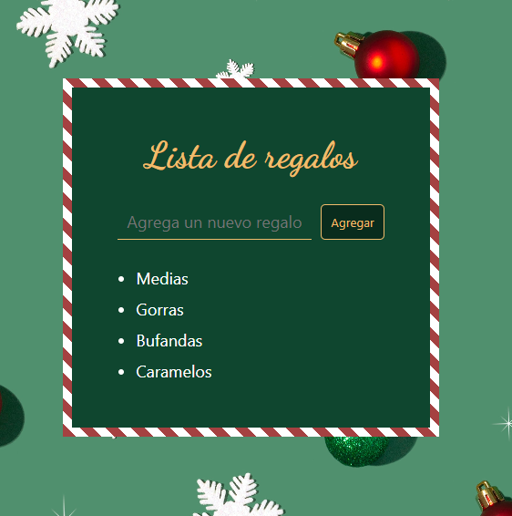

# Adviency - 2022

Calendario de adviento creado por [Goncy](https://twitter.com/goncy/status/1597581725382721538) para practicar. En este caso, voy a usar React con Typescript.

## Dia 1

Para calentar motores vamos a mantener las cosas simples, mostremos una lista de regalos, 3 elementos, fijos, sin nada más. 

## Dia 2

Día 2: Nuestra app se ve muy poco navideña, demosle unos colores más lindos, rojo, verde, amarillo! Podemos ponernos creativos con lo que queramos!

## Dia 3

Día 3: Estámos generosos, vamos a agregar un formulario con un input para escribir nuestro regalo y un botón para agregarlo a nuestra lista, todavía no los podemos borrar, pero... es navidad! Por que querríamos borrar regalos?

